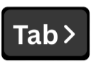

**TabOut** adds intelligent "tab‑out" to LeetCode's editor. Forget arrow keys — just hit Tab and fly past ) ] } ' " > , ;

## Features

- **Smart tab‑out** for `()`, `[]`, `{}`, `' '`, `" "`, `<>`, commas and semicolons
- **Multiple cursor** support
- **Works across LeetCode**: problems, contests, playground
- **Lightweight**: no UI clutter, minimal overhead
- **Privacy-focused**: no data collection, local processing only

## Installation

### Chrome Web Store (Recommended)

### Manual Installation
1. Clone this repository
2. Run `npm install && npm run build`
3. Open `chrome://extensions` → enable Developer mode
4. Click "Load unpacked" → select the `dist/` folder

### Controls
- **Popup**: Click the extension icon to quickly enable/disable
- **Options**: Right-click extension → Options for advanced settings

## Privacy & Permissions

### Data Collection
- **No personal data** or problem content is collected or transmitted
- **Local processing only** - all tab-out logic runs in your browser
- **Minimal storage** - only user preferences saved locally via Chrome sync

### Required Permissions
- **Host (leetcode.com, leetcode.cn)**: Run only on LeetCode pages to access the editor context
- **Scripting**: Inject a small page script to access Monaco APIs
- **Storage**: Save minimal preferences (enable/disable, debug) in Chrome sync
- **ActiveTab**: Read the active tab's hostname in the popup to display site status (privacy-focused alternative to broad tabs permission)

## Contributing

We welcome contributions! To report bugs, fix issues, or add features, visit the [Issues](https://github.com/pranavkale07/tabout-extension/issues) page. Please review our [Contribution Guide](CONTRIBUTING.md) for setup and contribution instructions.

## Future Enhancements

- **Firefox Support**: MV3 compatibility for Firefox 109+
- **More Platforms**: Support for other coding platforms (GeeksForGeeks, takeuforward, HackerRank, CodeChef, etc.)
- **Custom Delimiters**: User-defined tab-out patterns
- **Keyboard Shortcuts**: Customizable key bindings

## Acknowledgments

Special thanks to:
- [TabOut (VS Code Extension)](https://marketplace.visualstudio.com/items?itemName=albert.TabOut) - The VS Code extension that inspired this project
- [Monaco Editor](https://microsoft.github.io/monaco-editor/) - The powerful code editor that powers LeetCode and VS Code
- The open-source community for inspiration and feedback

## License

MIT License - see [LICENSE](LICENSE) file for details.
